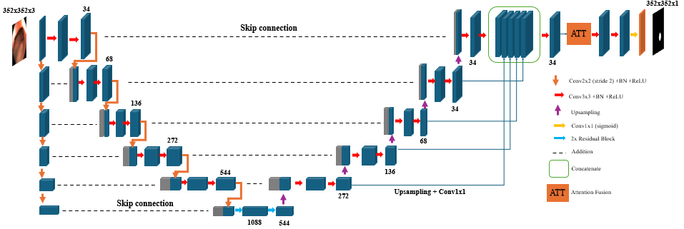

# U-Net ResFusion+ for Polyp Segmentation
U-Net ResFusion+ is an enhanced version of the U-Net model designed to improve the accuracy and efficiency of polyp segmentation in endoscopic images.

## Introduction

U-Net ResFusion+ is an enhanced version of the U-Net model designed to improve the accuracy and efficiency of polyp segmentation in endoscopic images. The model integrates residual blocks at the bottleneck, concatenation mechanisms, and attention blocks, which significantly boost its performance over standard U-Net models. The primary goal of this architecture is to provide better diagnostic tools for clinical practice by accurately identifying and segmenting polyps in medical images.

## Features

- **Residual Blocks**: Enhances the learning capability by allowing the gradient to flow through the network more effectively.
- **Concatenation Mechanisms**: Combines features from different layers to preserve high-resolution details and contextual information.
- **Attention Blocks**: Focuses on the most relevant features, improving the model’s accuracy in segmenting complex and small polyps.

## Performance

The U-Net ResFusion+ model has been tested on multiple datasets, including CVC-ClinicDB, Kvasir-SEG, CVC-ColonDB, and ETIS-Larib, demonstrating superior performance in terms of Dice coefficient and mean Intersection over Union (mIOU).

## Model Architecture



## Usage

### Prerequisites
- Python 
- TensorFlow
- Other dependencies listed in `requirements.txt`

### Installation

Clone the repository and install the required dependencies:

```bash
git clone https://github.com/khanhdat111/Unet-ResFusionPlus.git
cd Unet-ResFusionPlus
pip install -r requirements.txt

